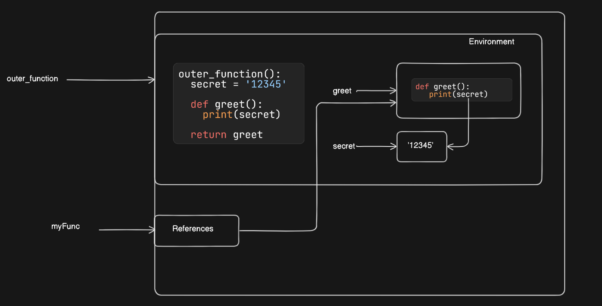
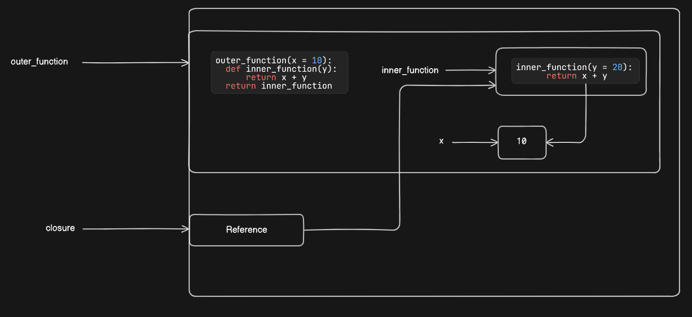

# Index
1. Closures
2. How closures work?
3. Use cases
--------------------------------------------------------------------------------------------------------------------------------------------------------------------------------------------------------------------
#### I. Closures
 - A Closure in Python is a programming concept where a nested (inner) function "remembers" the environment in which it was created, even if the outer function that created it has finished executing.
 - This allows the inner function to retain access to variables and state from its enclosing scope.
 - Key Characteristics of Closures:
    a. Nested Function: The closure must be a function defined inside another function.
    b. Access to Outer Variables: The inner function can access variables declared in the enclosing (outer) function, even after the outer function has finished execution.
    c. Returned Function: The outer function must return the inner function for it to be a closure.
    d. State Retention: The inner function "remembers" the variables from its enclosing scope without re-evaluating them

--------------------------------------------------------------------------------------------------------------------------------------------------------------------------------------------------------------------
#### II. How Closures Work:
 - When a function is defined inside another function, the inner function has access to:
    a. Its local variables
    b. The variables of the enclosing function (nonlocal scope).
    c. The global variables (if not shadowed by a local variable).
 - When the outer function returns the inner function, the inner function keeps a reference to the environment (or closure), which includes the variables in the outer function’s scope.
----------------------------------------------------------------
#### Example 1: Calling closure without argument

# secret = "12345"   # Global (Highly insecure)
x = 10               # Global scope

def outer_function():      # Outer function (Enclosing)
    secret = '12345'
    def greet():           # Inner function (Nested) : Closure
        y = 20   
        print(secret)      # nonlocal
        print(x)           # global
        print(y)           # local
    return greet
    

myFunc = outer_function()  # Calling environment  
myFunc()

----------------------------------------------------------------
#### Example 2: Calling closure with argument

def outer_function(x):
    def inner_function(y):
        return x + y
    return inner_function

closure = outer_function(10)   # Creating a closure

# Using the closure
print(closure(5))    # Output: 15
print(closure(20))   # Output: 30

--------------------------------------------------------------------------------------------------------------------------------------------------------------------------------------------------------------------
#### III. Use cases
#### Example 1: A simple counter
def make_counter():
    count = 0
    def counter():
        nonlocal count  # Refers to the count in the enclosing scope
        count += 1
        return count
    return counter

# Create a counter
counter_instance = make_counter()

# Increment the counter
print(counter_instance())  # Output: 1
print(counter_instance())  # Output: 2
print(counter_instance())  # Output: 3

-----------------------------------------------------------------------
#### Example 2: To log number of database connections established
# Defined by Uday
def connect_db():   # Outer function (Enclosing)
    count = 0
    def connect():    # Inner function (Nested)
        nonlocal count  # Refers to the count in the enclosing scope
        count += 1
        print("Connected to database")
        return count
    return connect

# Anil
db_connection = connect_db()
db_connection()
print(f"No of connections established till now: {db_connection()}") 

Output:
Connected to database
Connected to database
No of connections established till now: 2

-----------------------------------------------------------------------

